# Hi, I'm Abdul Raheem 👋

<picture>
  <source media="(prefers-color-scheme: dark)" srcset="https://readme-typing-svg.demolab.com/?font=Fira+Code&size=19&pause=1200&color=FFFFFF&center=true&vCenter=true&width=600&lines=Building+intelligent+systems+that+scale;From+machine+learning+to+autonomous+AI;From+backend+architecture+to+user+experience;Research-driven+engineering;Performance%2C+reliability+and+simplicity;Turning+ambitious+ideas+into+production+software" />
  
</picture>

---

<h2 align="center">The Engineer</h2>

Building intelligent software where Artificial Intelligence meets Software Engineering.

I enjoy designing and developing intelligent systems that solve real-world problems, combining
Artificial Intelligence, Machine Learning, backend engineering, scalable architectures, and
modern application development into production-ready solutions.

My interests span autonomous AI systems, large language models, distributed systems, system
design, cloud technologies, data engineering, and software architecture. I enjoy taking ideas
from research and transforming them into reliable, maintainable, and scalable products.

Beyond building applications, I'm constantly exploring emerging technologies, improving my
engineering fundamentals, and challenging myself to create software that is efficient,
adaptable, and built to last.

---

### 🧱 Built from my own contribution graph

<picture>
  <source media="(prefers-color-scheme: dark)" srcset="https://raw.githubusercontent.com/abd-RAHEEM/abd-RAHEEM/github-breakout/images/breakout-dark.svg" />
  <source media="(prefers-color-scheme: light)" srcset="https://raw.githubusercontent.com/abd-RAHEEM/abd-RAHEEM/github-breakout/images/breakout-light.svg" />
  
</picture>

---

<b>🧰 What's in the stack, if you're curious</b>

 

---

### GitHub Activity

 

---
